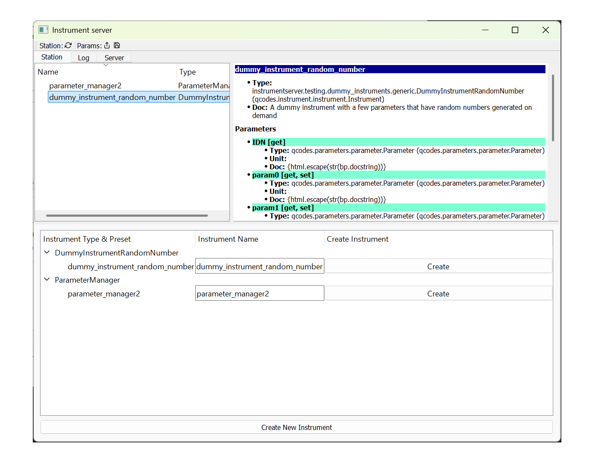
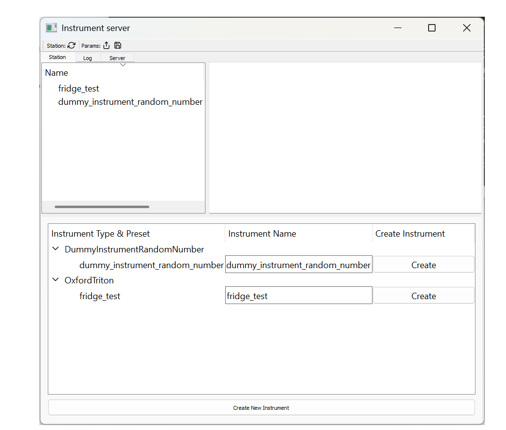
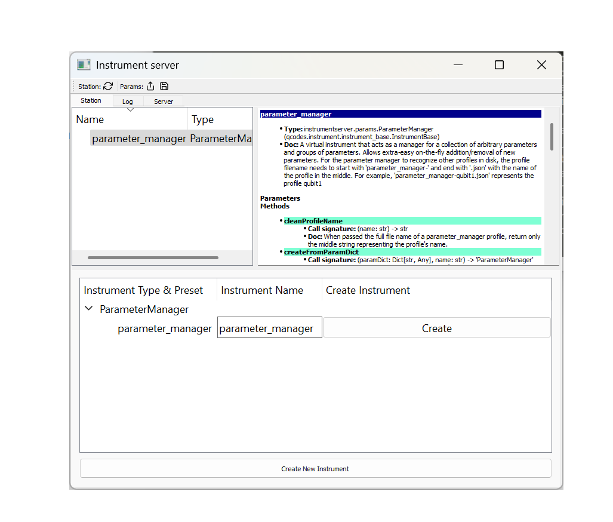

# Instrumentserver Overview

The aim of Instrumentserver is to facilitate [QCoDeS](https://qcodes.github.io/Qcodes/) access across a variety of process and devices.
We communicate with the server through a TCP/IP connection allowing us to talk to it from any independent process or
separate device in the same network.

Instrumentserver also includes a virtual instrument called Parameter Manager, whose job is to be a centralized and
single source of truth for various parameters values with a user-friendly graphical interface to facilitate changing
parameters.

:::{warning}
This guide is not up to date. Some new core features are not currently documented like configuration files and
new features are in development. If you have questions on how to use these, please contact Marcos at: [marcosf2@illinois.edu]().
:::

## Installation

At the moment Instrumentserver is not on pip or conda so the only way of installing it is to install it from github directly.
To do that first clone the [github repo](https://github.com/toolsforexperiments/instrumentserver),
and install into the desired environment using the
[editable pip install](https://pip.pypa.io/en/stable/cli/pip_install/#cmdoption-e).

## Quick Overview

### Instrumentserver


To open the instrument server we simple run the command on a terminal:

```bash
$ instrumentserver
```

This will open the GUI of the server and start running it.


:::{note}
The server can be run without a gui by passing the `--gui False` argument.
:::

If running the instrumentserver without the gui, the gui can be opened separately using the following command:
```bash
$ instrumentserver-detached
```

By default, instrumentserver listens to the local host IP address (127.0.0.1) and the port 5555. To be able to communicate
with the server through other devices in the network we have to specify the IP address we want the server to listen to.
For this we pass the argument `-a <IP_address>` and `-p <port_number>`:


```bash
$ instrumentserver -a 192.168.1.1 -p 12345
```

This will make the server listen to both the local host and the IP address 192.168.1.1 with port 12345.

We communicate with the server with Python code. This can be done anywhere that python can run, an IPython console, a Jupyter notebook, etc.
The easiest way of creating a [Client instance](https://github.com/toolsforexperiments/instrumentserver/blob/b9270871364febcfb2ca8ce00b6182ee1762448b/instrumentserver/client/proxy.py#L375) and
running the [find_or_create_instrument](https://github.com/toolsforexperiments/instrumentserver/blob/b9270871364febcfb2ca8ce00b6182ee1762448b/instrumentserver/client/proxy.py#L384) method.

:::{note}
Remember to pass the instrument specific arguments and keyword arguments necessary for the specific QCoDeS instrument
you are trying to open.
:::

This will look for the specified instrument with the given name in the server or create it if the instrument does not
exist, and return it:

```python
>>> cli = Client()
>>> dummy_instrument = cli.find_or_create_instrument(instrument_class='instrumentserver.testing.dummy_instruments.generic.DummyChannel', name='dummy_instrument')
```

:::{note}
If we are trying to talk to a server running in a different device in the network we need to specify the IP address
and port with the arguments host and port when creating the [Client](https://github.com/toolsforexperiments/instrumentserver/blob/b9270871364febcfb2ca8ce00b6182ee1762448b/instrumentserver/client/proxy.py#L375).
:::

After this we can see that the instrument has been created in the server.



After that we can use the instrument like a normal QCoDeS instrument. We can create a [Client](https://github.com/toolsforexperiments/instrumentserver/blob/b9270871364febcfb2ca8ce00b6182ee1762448b/instrumentserver/client/proxy.py#L375)
from any process and get the dummy_instrument by simply using the [find_or_create_instrument](https://github.com/toolsforexperiments/instrumentserver/blob/b9270871364febcfb2ca8ce00b6182ee1762448b/instrumentserver/client/proxy.py#L384) method:

```python
>>> dummy_instrument = cli.find_or_create_instrument(name='dummy_instrument')
```

### Parameter Manager

:::{note}
The parameter manager can also be opened from a config file, more instructions on how to do this will come in the near future.
:::

Instrumentserver also comes with the virtual instrument Parameter Manager.
The Parameter Manager allows us to store values in an instrument inside of the Instrumentserver, allowing us to access them from any process or devices in the same network.
The idea of it is to have a single source of truth for parameters whose values change frequently, and it provides a GUI from which you can change the values and easily see what they are.

To open the Parameter Manager we first need to open the Instrumentserver.
Once we have the server open, we can run the command:

```bash
$ instrumentserver-param-manager
```
This will create an instance of the virtual instrument in the Instrumentserver and will open the GUI for the Parameter Manager.

:::{note}
At the moment the parameter manager can only be opened from the device that is currently hosting the server.
If you are utilizing a different port, this can be specified by passing the terminal argument `--port` followed by the port.
:::

We'll simply get an empty window now.
The bottom of the window allows us to add arbitrary parameters and values, where dots serve as hierarchy separators (like objects and their children in python).


We can add some parameters and then retrieve them from anywhere that can run python code:

```python
>>> cli = Client()
>>> params = cli.find_or_create_instrument('parameter_manager') # 'parameter_manager` is the name the startup script gives the instrument by default
>>> params.qubit.pipulse.len()
40
```

We can change parameters by calling the same function but passing as an argument the new value:

```python
>>> params.qubit.pipulse.len(789)
```

We can add or remove parameters with code too:

```python
>>> params.add_parameter('qubit.anharmonicity', initial_value=-150.0, unit='MHz')
>>> params.remove_parameter('qubit.pipulse.amp')
```

All of these changes get updated live in the GUI:


Changing things in the GUI will also be reflected in the code.

:::{warning}
Changing something from the GUI only changes the code if we are calling the parameter manager directly.
If we store a value in a separate variable and then change the GUI, the value in the variable might not get updated.
Because of this, we always recommend to call the Parameter Manager directly instead of saving the values in variables.
:::

## Config Files

The instrumentserver also contains functionality for config files. These config files contain set-up for QCoDeS instruments. These config files can then be used by the instrumentserver 
on start-up to have the desired instruments already created without having to manually add them after starting the server.

To open the instrument server with a config file, we can use the '-c' flag to specify a config file, followed by the path to the config file:

```bash
$ instrumentserver -c serverConfig.yml
```


Below is a sample config file to initialize a DummyInstrument and an Oxford Triton dilution refrigerator

`instruments`: this field will contain each instrument you wish to create. Under this field should be the names of each instrument you are creating

`type`: This specifies which QCoDeS driver the instrumentserver should use to create the instrument. Can either be a local file or a community-created driver

`address`: the tcp/ip address of the instrument on the same network as the instrumentserver

`port`: which port (of the instrument) to communicate with (can generally be found in the manual of the instrument)

```yaml
instruments:
  dummy_instrument_random_number:
    type: instrumentserver.testing.dummy_instruments.generic.DummyInstrumentRandomNumber
    initialize: True
  fridge_test:
    type: labcore.instruments.qcodes_drivers.Oxford.triton.OxfordTriton
    address: 192.168.256.256
    init: 
      port: 33576
```

This is the result of running the instrument server with this config file:



### Parameter Manager with Config Files

The instrumentserver also comes with the virtual instrument Parameter Manager.
The Parameter Manager allows us to store values in an instrument inside of the Instrumentserver, allowing access from any process or device in the same network.
The idea of it is to have a single source of truth for parameters whose values change frequently, and it provides a GUI from which you can change the values and easily see what they are.

The following is an example config file to add the parameter manager as a virtual instrument

```yaml
instruments:
  parameter_manager:
    type: instrumentserver.params.ParameterManager
    initialize: True
    gui:
      type: instrumentserver.gui.instruments.ParameterManagerGui
```




The instrumentserver also supports loading parameters from a file. They can also be created manually either from the terminal or the GUI.


Below is an example of a parameter file

```json
{
  "parameter_manager.active.qubit": {
    "unit": "",
    "value": "qC"
  },
  "parameter_manager.opx.const_amp": {
    "unit": "",
    "value": 5
  }
}
```