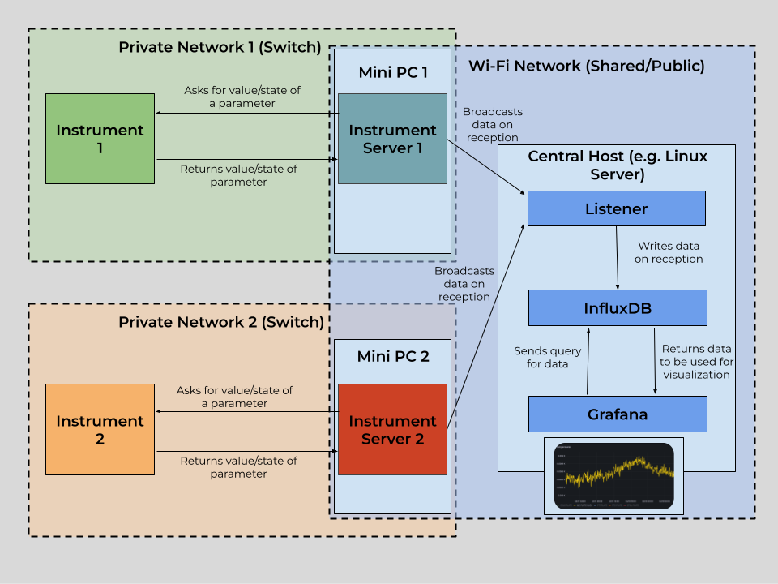
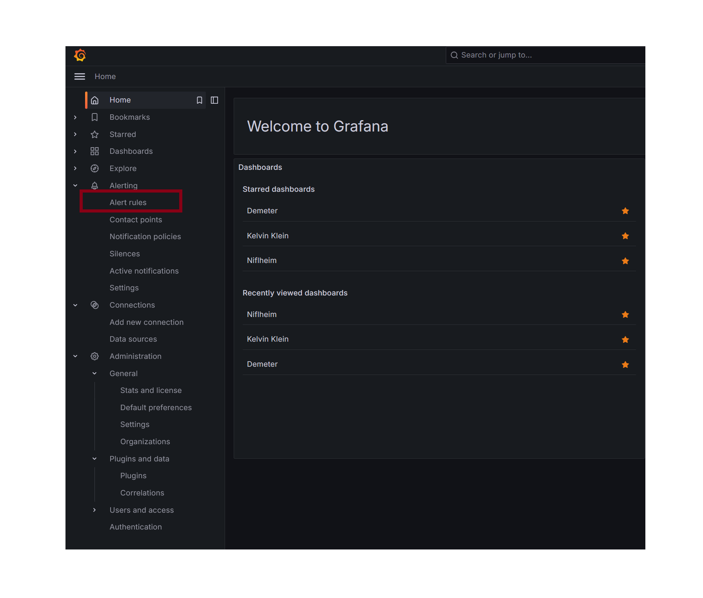
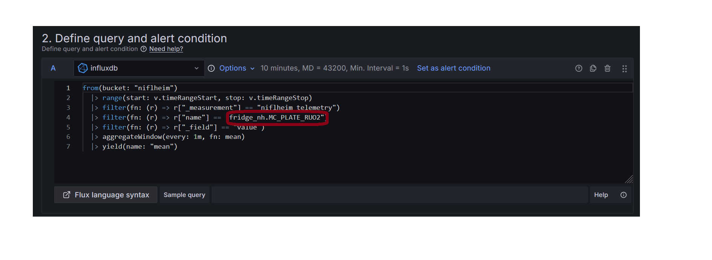
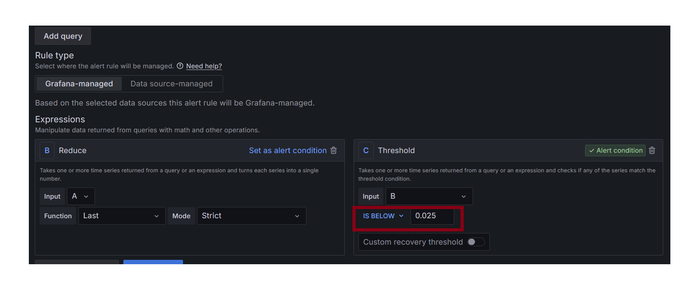
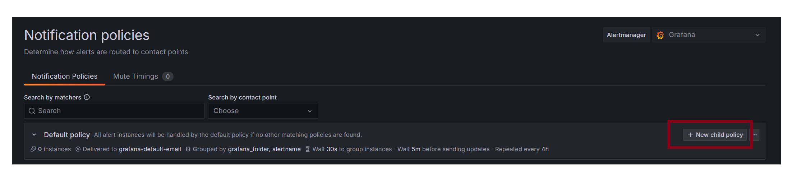
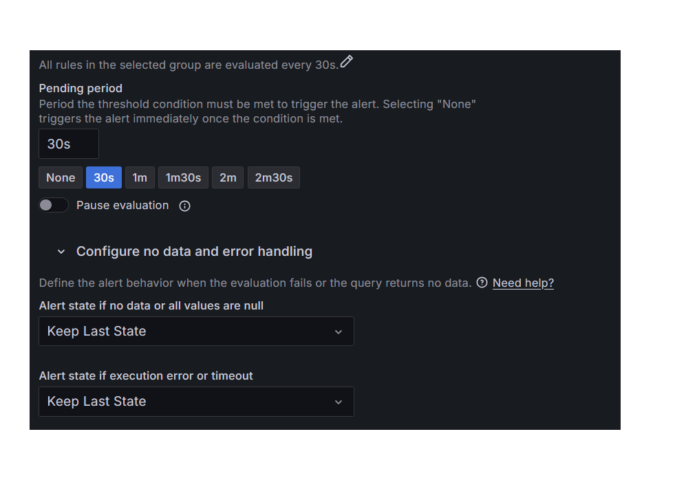

# Instrument Monitoring

The following is a guide to set up a dashboard for the monitoring of instruments. It contains capabilities for data storage, data visualization, and real-time alerts. More information on the tool is provided in the next section.

:::{note}
The following guide assumes the user has the instrumentserver installed and has basic familiarity with it and using config files, labcore installed, basic familiarity with Docker, and a basic understanding of what Grafana and InfluxDB are
:::

## Overview

This tool is designed to be able to facilitate the monitoring of instruments. It consists of multiple parts that must be set up:



Above is a diagram showcasing the architecture for a dashboard for the monitoring of two separate instruments. The architecture consists of two PCs that communicate with the instrument using qCoDeS, which broadcast the data they receive to a central computer where the dashboard is hosted.

[Docker](#docker)

Docker is the service used to host Grafana and InfluxDB locally. Both of the services have a server that runs inside of a Docker container on your internet-connected device, and will be accessible through the network the computer is connected to. Both Influx and Grafana will be accessible with an internet connection to the computer running Docker.

[Grafana](#grafana)

Grafana is the service used to visualize the data gathered from your instrument(s) of choice. It has functionality to both have visualization through dashboards, and also alerting capabilities through Slack integration and more. Below is an example of what a Grafana dashboard may look like.

Grafana is hosted locally on a internet-connected device, and can then be viewed while connected to the network and logging in to your Grafana account. It will live in a Docker container. (More on that later)


Below is a sample alert send out by Grafana on Slack. The alert notifies that a parameter (in this case MC) has passed a threshold. This is for a dilution refrigerator, and the parameter in this case is a value from a temperature sensor. This one, MC, is in the mixing chamber.


[InfluxDB](#influxdb)

InfluxDB is the database used to store data fetched from instruments. It stores the data in time-series format (each data point has a time). It can then be accessed by Grafana in order to construct time-series plots of the various parameters in the database (as shown above).

InfluxDB should be hosted on the same device as Grafana. It will also be in a Docker container. (again, more on that later)

[The Instrumentserver](#the-instrumentserver)

The instrumentserver runs on a computer that can talk with your instrument through a network connection. The instrumentserver will ask your instrument for the data you specify, which will then be sent back to the instrumentserver by the instrument.

Based on a yaml config file, the instrumentserver can then ask for the correct data from the instrument and broadcast it to the internet (to be used for visualizations).

In the instrumentserver, for each instrument, the user provides a list of parameters to get values or states from, with a corresponding rate (in seconds) for how often to poll the parameter.

[The Listener](#the-listener)

The listener is ran on the same computer that is running the Docker containers for Grafana and InfluxDB. It subscribes to the broadcasts from the instrumentservers, and then writes the data to the InfluxDB database. The listener can also be configured to write to a CSV file, however InfluxDB is recommended.

:::{note}
The following portion assumes the user has the instrumentserver installed and labcore installed.
:::

## Quick Start Guide

This section is a guide to quickly set up an instrument monitoring dashboard for an arbitrary number of instruments.

### Step 1: Instrumentserver setup

First, locate or create a qCoDeS driver for your instrument. Also, make sure the instrument is connected to some sort of network (generally a switch), and find its IP address on the private network. Also, locate the correct port to communicate with the instrument (generally found in the manual for the instrument).

Once you have all of this information, set up a PC (windows, linux, etc.) that is connected to the same network (switch) as the instrument you want to monitor. Install the instrumentserver and labcore on this PC.

Decide on a port you want to broadcast data through on the PC. Then create a config file for the instrumentserver using the above qCoDeS driver, ports, etc. Check out the section for the instrumentserver [config file](#config-file).

Then, start the instrumentserver. See [starting the instrumentserver](#starting-the-instrument-server).

### Step 2: InfluxDB and Grafana

Set up a PC that you would like to host the dashboard on. Install labcore and the instrumentserver on this PC.
Install docker and start the docker engine. Follow the [docker section](#docker) to set up a docker compose file. Make sure that InfluxDB and Grafana are able to be accessed.

### Step 3: The Listener

 On the same PC that Grafana and Influx were started on:
 
 Keep track of the address and port that the instrumentserver is broadcasting to in the previous section. Use this information, the information you used to set up InfluxDB, plus the parameters you want to monitor to fill out the [config file](#config-file-1).

You can then [start the listener](#starting-the-listener).

### Step 4: Grafana Customization

If the previous steps were done correctly with no issues, the Influx database should start to be populated. Then, one can follow the guide at https://grafana.com/grafana/dashboards/ in order to create a dashboard using InfluxDB as data source. The grafana documentation also has guides on setting up alerting to Slack and other services.


## The Instrumentserver

In order to use the dashboard, we will need to have an instance of the instrumentserver running to fetch data from the fridge computer. 

### Config File

Below is an example instrumentserver configuration file that can be used for the dashboard.


```yaml
instruments:
  
  fridge_nh:
    type: labcore.instruments.qcodes_drivers.Oxford.triton.OxfordTriton
    address: 192.168.1.1
    init: 
      port: 33576
      temp_channel_mapping:
          T1: "PT2_HEAD"
          T2: "PT2_PLATE"
          T3: "STILL_PLATE"
          T4: "COLD_PLATE"
          T6: "PT1_HEAD"
          T7: "PT1_PLATE"
          T8: "MC_PLATE_RUO2"

    pollingRate:
      comp_state: 15
      PT1_PLATE: 15
      PT2_PLATE: 15
      STILL_PLATE: 15
      COLD_PLATE: 15
      MC_PLATE_RUO2: 15
      turb1_state: 15
      turb1_speed: 15

networking:
  externalBroadcast: "tcp://128.174.123.123:6000"
```


As usual, we declare an qCoDeS instrument. In this case we are using an Oxford Triton Dilution Refrigerator. The driver for this instrument is in labcore:

```
labcore.instruments.qcodes_drivers.Oxford.triton.OxfordTriton
```

In general, one can find a community-made driver (if it exists), or create one.

`address`: fill out the field with the IPv4 address of the instrument (on the same network as the computer you are running the instrumentserver on)

`init`: there are two items that must be filled out:

`port`: From the manual of the instrument being used, provide the port to communicate with. (For Oxford Triton, this port is `33576`).

`pollingRate`: provide a dictionary for how often to poll each parameter given. For each parameter that you wish to fetch data for, add it as a new line in the dictionary, followed by the interval (in seconds) to fetch it.

`networking`: For the dashboard, only one field is required, `externalBroadcast`. Locate the IPv4 address of the computer you are running the instrumentserver on for the internet network you wish to broadcast the data to. Include the port to broadcast to as well.

Specific to Oxford Triton (from the driver):
`temp_channel_mapping`: Create a dictionary containing the mapping between name and temperature channel for each channel you would like a named parameter for. In the provided config, 7 Temperature Channels are used to create named parameters. Channels can be found on the Lakeshore thermometry dialog on the fridge computer.

### Starting the Instrument Server


Use the following to start the instrumentserver. Replace serverConfig.yml with the path to the config file you created above.

```bash
$ instrumentserver -c serverConfig.yml --gui False
```

You should start the instrumentserver using the above commmand in no GUI mode first (to improve stability). Then, you can use the following detached mode if you wish to use the GUI:

```bash
$ instrumentserver-detached
```

:::{note}
The following portion assumes the user has:
- instrumentserver installed
:::

## The Listener

To use the dashboard, we will also need to run an instance of the listener on whichever computer you wish to host the dashboard on. (The computer with the listener and the computer with the instrumentserver must be on the same network). The listener can be used for writing data either in a CSV file or the InfluxDB database.

### Config File

Below is an example listener configuration file that can be used for the dashboard.

```yaml

# addresses to listen for broadcasts at
addresses: ["tcp://128.174.123.123:6000","tcp://128.174.456.456:6000","tcp://128.174.789.789:6000"]

# list of parameters to listen for, if empty, will listen for all broadcasts
params: []

# path to write data to for the CSV listener
csv_path: C:\Users\jmnol\OneDrive\Documents\InstrumentServerData\data.csv

# type of listener (where the listener writes data to)
type: "Influx"

# InfluxDB token for Influx listener
token: "token"

# InfluxDB org for Influx listener
org: "pfafflab"

# InfluxDB buckets for Influx listener, in the same order as addresses
bucketDict: {"fridge_nh":"niflheim","fridge_kk":"kelvin_klein","fridge_dt":"demeter"}

# InfluxDB url for Influx listener
url: "http://localhost:8086"

# measurement Name for Influx listener
measurementNameDict: {"fridge_nh":"niflheim_telemetry","fridge_kk":"kelvin_klein_telemetry","fridge_dt":"demeter_telemetry"}
```

#### Necessary Parameters for using InfluxDB

`addresses`: List of addresses of where to subscribe to broadcasts from. These are the addresses on the network of the computer running the instrumentserver

`params`: List of all parameters to listen for, if empty, the listener will listen to all broadcasts

`type`: "Influx"

`token`: Token to write to InfluxDB. (Created when setting up Influx)

`org`: Organization to write to InfluxDB. (Created when setting up Influx)

`bucketDict`: Dictionary containing the mapping for each instrument to a bucket in Influx

`url`: URL to where the Influx database is hosted on the computer running the listener

`measurementNameDict`: Name of the measurement (one of the fields for a data point) that will be applied to the data from an instrument

#### Necessary Parameters for using CSV

`addresses`: List of addresses of where to subscribe to broadcasts from. These are the addresses on the network of the computer running the instrumentserver

`paramDict`: Dictionary containing the list of parameters to listen for for each instrument. If the list for an instrument is empty, the listener will listen for all broadcasts from that instrument.

`csv_path`: Path of the csv file to write data to. A CSV file doesn't need to exist at the path as the listener will create one if one does not exist.

`type`: "CSV"

### Starting the Listener

Use the following to start the instrumentserver. Replace listenerConfig.yml with the path to the config file you created above.

```bash
$ instrumentserver-listener -c listenerConfig.yml
```

One may choose to use the following command to not display output and instead have it written to a file:

```bash
$ nohup instrumentserver-listener -c listenerConfig.yml
```

The process can be killed with:

```bash
$ ps aux | grep instrumentserver-listener
```

You can then find the ID number of the process and kill it with:

```bash
$ kill -15 {INSERT ID}
```

:::{note}
The following portion assumes the user has the Docker Engine installed and basic familiarity with Docker
:::

## Docker

Docker is the service that will be used to host both Influx and Grafana.

```yaml
services:

  grafana:

    image: grafana
    container_name: grafana
    restart: unless-stopped

    ports:
     - '1000:1000'

    volumes:
      - grafana-storage:/var/lib/grafana
      - ./data:/etc/grafana/data

    entrypoint: ["/bin/sh", "-c", "export GF_SECURITY_ADMIN_USER=$(cat /run/secrets/.env.grafana-username) && /run.sh"]
    entrypoint: ["/bin/sh", "-c", "export GF_SECURITY_ADMIN_PASSWORD=$(cat /run/secrets/.env.grafana-password) && /run.sh"]

    secrets:
      - grafana-username
      - grafana-password

  influxdb2:

    image: influxdb:2

    ports:
      - 8080:8080

    environment:
      DOCKER_INFLUXDB_INIT_MODE: setup
      DOCKER_INFLUXDB_INIT_USERNAME_FILE: /run/secrets/influxdb2-admin-username
      DOCKER_INFLUXDB_INIT_PASSWORD_FILE: /run/secrets/influxdb2-admin-password
      DOCKER_INFLUXDB_INIT_ADMIN_TOKEN_FILE: /run/secrets/influxdb2-admin-token
      DOCKER_INFLUXDB_INIT_ORG: org
      DOCKER_INFLUXDB_INIT_BUCKET: bucket1

    secrets:
      - influxdb2-admin-username
      - influxdb2-admin-password
      - influxdb2-admin-token

    volumes:
      - type: volume
        source: influxdb2-data
        target: /var/lib/influxdb2
      - type: volume
        source: influxdb2-config
        target: /etc/influxdb2

volumes:
  grafana-storage: {}
  influxdb2-data:
  influxdb2-config:

secrets:
  grafana-username:
    file: .env.grafana-username
  grafana-password:
    file: .env.grafana-password
  influxdb2-admin-username:
    file: .env.influxdb2-admin-username
  influxdb2-admin-password:
    file: .env.influxdb2-admin-password
  influxdb2-admin-token:
    file: .env.influxdb2-admin-token
```

Above is a sample Docker Compose file. This is what is used to start the instances of Grafana and InfluxDB. Most of it should not be modified.

To use the above file, provide 5 files:
```
 .env.grafana-username
 .env.grafana-password
 .env.influxdb2-admin-username
 .env.influxdb2-admin-password
 .env.influxdb2-admin-token
```
These will be the respective usernames and passwords for each service, and then a token for the database, which is used by the entity writing to the database. These files should be in the same directory as the docker compose file.

If you wish to add more plugins, modify a few things:

1. Modify the Dockerfile. On the line including, "GF_INSTALL_PLUGINS", include your wanted plugins in a comma-separated list.

2. Run the following command:
```bash
$ sudo docker build -t (insert-image-name) .
```
Replace (insert-image-name) with your desired name and directory location.

3. Modify the docker compose file:
Under the grafana section, under "image", replace the default image "grafana" with your newly created image.

Now that your Docker compose is fully set up, you can start both services with the following command (run in the directory of the docker compose file)
```bash
$ sudo docker compose up -d
```

You can then close both with the following:
```bash
$ sudo docker compose down
```
:::{note}
Closing will take ~ 10 seconds
:::

## InfluxDB

Now that you have the instances of Grafana and Influx working, there is a bit more setup necessary to put it all together.

First, you must create a bucket where you wish to store your data.

Now, you should have all of the necessary information to fill out the config file for the listener (section is above). As long as everything is set up correctly, if the listener is running and receiving data, it should be writing the data it receives to Influx.

## Grafana

Now that you have an Influx database being populated by your data, you are ready to set up a dashboard. To create a dashboard, please follow the documentation for grafana https://grafana.com/docs/grafana/latest/dashboards/.

To use the data from Influx, you must add it as a source: https://grafana.com/docs/grafana/latest/datasources/

Then, within each panel of the dashboard, you must write a query to get the correct data from the database.

Here is an example query that may be helpful (or a good starting point):
```
from(bucket: "bucket1")
  |> range(start: v.timeRangeStart, stop: v.timeRangeStop)
  |> filter(fn: (r) => r["_measurement"] == "measurement1")
  |> filter(fn: (r) => r["_field"] == "value")
  |> filter(fn: (r) => r["name"] == "bucket1.param1" or r["name"] == "bucket1.param2")
  |> aggregateWindow(every: v.windowPeriod, fn: mean, createEmpty: false)
  |> yield(name: "mean")
```
The above query will display parameters in bucket1 with fields "measurement" being "measurement1", "field" being "value", and name being "param1" or "param2".

When creating your panel, select "Time Series" in Grafana.

More information on creating dashboards can be found on the grafana documentation page: https://grafana.com/docs/grafana/latest/dashboards/.

Also, information on setting up Slack alerts can also be found there.

### Notification Templates

Here is a sample notification template:

```go
{{ define "general.title" }}
{{ if gt (len .Alerts) 0 }}
{{ range .Alerts }}
Alert: {{ .Labels.alertname }} - {{ .Status | title }}
{{ end }}
{{ else }}
No active alerts
{{ end }}
{{ end }}

{{ define "general.message" }}
{{ if or (gt (len .Alerts.Firing) 0) (gt (len .Alerts.Resolved) 0) }}
{{ if gt (len .Alerts.Firing) 0 }}
{{ range .Alerts.Firing }}
- **Alert Name:** {{ .Labels.alertname }}
- **Description:** {{ .Annotations.summary }}
{{ end }}
{{ end }}

{{ if gt (len .Alerts.Resolved) 0 }}
{{ range .Alerts.Resolved }}
- **Alert Name:** {{ .Labels.alertname }}
- **Description:** {{ .Annotations.summary }}
{{ end }}
{{ end }}
{{ else }}
No alerts to display.
{{ end }}
{{ end }}
```

### Creating Alert Conditions in Grafana

On the homepage, navigate to Alert Rules



For creating new alerts rules for a dashboard with existing rules, it is easiest to duplicate an existing rule. Navigate under the folder of the instrument you wish to create a new alert for:


First, enter the name of the alert you want to add:


If you are creating an alert for a parameter that is different from the rule you duplicated, you must change the database query. Replace the highlighted portion with the parameter you want to set up an alert for. (Names of parameters can be seen under the dashboard graphs)



To change the alert condition, only modify the highlighted portion, select a condition such as "is below", and then input the wanted value of the condition. For example if we wanted to send an alert when the temperature of a plate goes below 50 mK, you would choose "is below" and "0.050".




Assuming you duplicating an existing alert, the only part left to add is a description like the picture shown below:


Then, navigate to the top right of the screen and select "Save rule and exit".

The new alert rule should now be working.

#### Creating Slack Bots

To create a slack bot, head to https://api.slack.com/apps. Create a new application, and add it to the slack workspace you want to send alert in. Go to your application, and go to "Incoming Webhooks" under Features. Create a new webhook with the channel you want to post alerts in. You will use this in Grafana in order to send messages in slack.

In this application menu, you can also edit other general features of the bot, such as its status, description, and profile picture.

#### Creating Alert Conditions from Scratch

If there are no existing alert conditions for the dashboard you wish to set up, follow this portion.

First, navigate to the Contact Points tab. Go to Notification Templates and make sure you have a message and title template. Examples can be found in [notificationtemplates](#notification-templates).

Then, go back to the main contact points tab, and check if there is a contact point for the dashboard you are setting up alerts for. If not, select "Create Contact Point".


Choose a name corresponding to the dashboard. Choose your integration type. For this guide we will choose Slack. Then, fill in the Webhook url section with the webhook of the channel you wish to send alerts to. You must have a Slack App set up. Information on how to do this can be found on Slack API website.

Then, under optional slack settings, use the two created templates to upload to the "title" and "text body" fields.

Navigate to the Notification Policies tab, under Alerting. Under the default policy, select "new child policy".



Fill in the label portion with the name of the instrument/dashboard, and have the condition be "= 1". Add the contact point you just created to the policy. Then, select "Override General timings", and set the repeat interval to a high number "say 52w". This will ensure the alert will only fire once, at the moment the threshold is passed.

Then, navigate to the alert rules tab and select "New alert rule". Follow [creatingconditions](#creating-alert-conditions-in-grafana) to fill out sections 1 and 2.

Now you should be on section 3. "Set evaluation behaviour. I would recommend creating a new folder for your instrument/dashboard if one does not exist. Then, create a default evaluation group (can be used for all the elements in the folder). I have found that evaluation every 30 seconds with a 30 second pending period work well. Then, navigate to "Configure no data and error handling". I have found that using "Keep Last State" for both will result in no false alerts if missing/bad data is encountered.



Then, under "Configure labels and notifications", set your label you created on the notification policy to 1, and under "Notifications", select "Use notification policy"

You may want to use the preview routing option to make sure everything is set up correctly.

Then, you should configure the notification message under part 5 with a description for your alert. Then you can select "Save rule and exit" in the top right.

Your alert condition should now be working correctly and sending slack alerts when the threshold you set it passed.